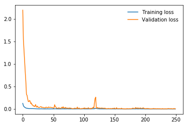

# Introdução

Para nosso trabalho, utilizandos o dataset ["Hand Gesture Recognition Database"](https://www.kaggle.com/gti-upm/leapgestrecog), que contém 10 gestos manuais demonstrados por 10 pessoas diferentes, sendo 5 homens e 5 mulheres. Para cada indíviduo, 2000 imagens foram coletadas, 200 imagens para cada gesto. A resolução das imagens é de 640 x 240 pixels.

Escolhemos este dataset por ser composto de imagens, o que nos permite explorar melhor a natureza de redes neurais convolucionais. Também foi escolhido por não ser um dataset muito grande, o que torna o ciclo de treino e verificação moderadamente curto em hardware _mid-tier_.

Dessa forma, conseguimos explorar diferentes topologias e alcançarmos uma boa acurácia, durante vários momentos das diferentes etapas de validação, assim como em uma fase final de teste para cada topologia e combinação de hiperparâmetros que foi abordada.

# Resnet50

Nossas primeiras tentativas partiram de uma rede Resnet50, com a seguinte topologia sequencial:

- Linear(2048, 512)
- ReLU
- Dropout(0.2)
- Linear(512, 10)
- LogSoftmax(dim=1)

Como algoritmo de otimização, utilizamos Adam, por utilizar pouca memória, ser computacionalmente eficiente e possuir hiperparâmetros de fácil compreensão.

Já nos primeiros testes, percebemos que ao utilizarmos um _BATCH_SIZE_ muito pequeno, o processo de treino era consideravelmente lento. Concluímos que, ao utilizar um _BATCH_SIZE_ muito pequeno, tanto a CPU como a GPU ficavam muito tempo ociosas, enquanto os dados trafegavam pelo barramento PCI Express em cada ciclo do treinamento.

Aumentamos o _BATCH_SIZE_ para 64, e em alguns minutos conseguimos executar 10 épocas em uma RTX 2060, assim como no Google Collab.

Os resultados foram excelentes. A rede obtém 99% de precisão durante a validação, assim como no teste final.

# Conclusão

Some stuff here
